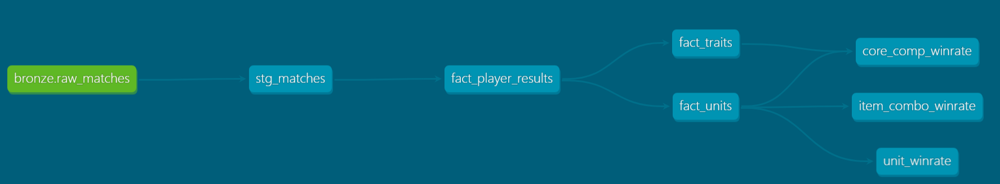

# dbt — TFT Data Platform

Projeto dbt responsável pelas transformações Bronze → Staging → Silver → Gold. Executado via Cloud Run Job (`tft-dbt-runner`) trigado pelo `tft-pipeline-events` Pub/Sub após cada coleta.

---

## Estrutura

```
dbt/
├── Dockerfile              # Imagem do Cloud Run Job
├── entrypoint.sh           # Orquestra os comandos dbt por RUN_MODE
├── requirements.txt        # dbt-core + dbt-bigquery
└── tft_dbt/
    ├── dbt_project.yml
    ├── profiles.yml
    └── models/
        ├── staging/
        │   ├── sources.yml          # Define a External Table tft_bronze.raw_matches
        │   └── stg_matches.sql      # View — extrai JSON Bronze em colunas tipadas
        ├── silver/
        │   ├── schema.yml
        │   ├── fact_player_results.sql  # 1 linha por jogador por partida
        │   ├── fact_traits.sql          # 1 linha por trait por jogador por partida
        │   └── fact_units.sql           # 1 linha por unit por jogador por partida
        └── gold/
            ├── schema.yml
            ├── unit_winrate.sql         # Top4/win rate por campeão
            ├── core_comp_winrate.sql    # Top4/win rate por composição completa
            └── item_combo_winrate.sql   # Top4/win rate por build de itens
```

---

## Lineage



```
tft_bronze.raw_matches (External Table — GCS)
    └── stg_matches (view)
            └── fact_player_results (incremental — grain: jogador × partida)
                    ├── fact_traits  (incremental — grain: trait × jogador × partida)
                    └── fact_units   (incremental — grain: unit × jogador × partida)
                            ├── unit_winrate       (table — gold)
                            ├── core_comp_winrate  (table — gold)
                            └── item_combo_winrate (table — gold)
```

> `fact_traits` e `fact_units` são semânticamente tabelas fato — cada linha representa um evento (um trait/unit em uma partida específica de um jogador). A dependência em `fact_player_results` é intencional pois os arrays `traits_json` e `units_json` já estão explodidos por participante nessa tabela.

---

## Modelos

### Staging

| Modelo | Materialização | Descrição |
|---|---|---|
| `stg_matches` | view | Extrai campos do JSON Bronze em colunas tipadas. View para evitar custo de armazenamento — reflete automaticamente novos dados no GCS. |

### Silver

Todos os modelos Silver são **incrementais**, particionados por `ingestion_date` e filtram pelo `MAX(ingestion_date)` já presente na tabela.

| Modelo | Grain | Unique key |
|---|---|---|
| `fact_player_results` | jogador × partida | `[match_id, puuid]` |
| `fact_traits` | trait × jogador × partida | `[match_id, puuid, trait_name]` |
| `fact_units` | unit × jogador × partida | `unit_key` (surrogate) |

**`fact_units`** usa chave surrogada `unit_key = CONCAT(match_id, '_', puuid, '_', unit_position)` para lidar com múltiplas cópias do mesmo campeão (ex: 2x Yasuo tier 1 antes de virar 2 estrelas) sem duplicatas no MERGE incremental.

### Gold

Todos os modelos Gold são **tabelas** (recalculadas a cada run) e incluem:
- `patch` — extraído do `game_version` via `REGEXP_EXTRACT`
- `performance_tier` — S/A/B/C/N/A calculado pelo top4_rate com mínimo de 15 partidas
- `icon_url` — URL pública do GCS para uso no Looker Studio

| Modelo | Descrição | Filtro mínimo |
|---|---|---|
| `unit_winrate` | Top4/win rate por campeão, tier de estrelas e rarity | 10 partidas |
| `core_comp_winrate` | Top4/win rate por composição completa (até 9 units) | 3 partidas |
| `item_combo_winrate` | Top4/win rate por build de itens (BiS) por campeão | 5 partidas |

**Performance tier:**
```sql
CASE
    WHEN COUNT(*) < 15  THEN 'N/A'  -- dados insuficientes
    WHEN top4_rate >= 80 THEN 'S'
    WHEN top4_rate >= 70 THEN 'A'
    WHEN top4_rate >= 50 THEN 'B'
    ELSE 'C'
END
```

---

## Cloud Run Job

O dbt roda em um container Docker no Cloud Run Job `tft-dbt-runner`.

### Variáveis de ambiente

| Variável | Padrão | Descrição |
|---|---|---|
| `PROJECT_ID` | — | ID do projeto GCP |
| `RUN_MODE` | `daily` | Quais camadas rodar |
| `FULL_REFRESH` | `false` | Recriar tabelas do zero |

### Modos de execução (`RUN_MODE`)

| Modo | O que executa |
|---|---|
| `daily` | staging → silver (+ test) → gold (+ test) |
| `staging` | apenas stg_matches |
| `silver` | apenas modelos silver |
| `gold` | apenas modelos gold (com dependências Silver) |
| `full` | todos os modelos + todos os testes |

---

## Comandos operacionais

```bash
# Execução incremental padrão (equivale ao RUN_MODE=daily)
gcloud run jobs execute tft-dbt-runner \
    --project=tft-gcp-integration --region=us-central1

# Full refresh — recria todas as tabelas do zero
gcloud run jobs execute tft-dbt-runner \
    --project=tft-gcp-integration --region=us-central1 \
    --update-env-vars="FULL_REFRESH=true"

# Rodar apenas Gold
gcloud run jobs execute tft-dbt-runner \
    --project=tft-gcp-integration --region=us-central1 \
    --update-env-vars="RUN_MODE=gold"

# Ver logs da última execução
gcloud run jobs executions list \
    --job=tft-dbt-runner --region=us-central1 --limit=5

# Redeploy da imagem (após mudança nos modelos)
gcloud builds submit dbt/ \
    --project=tft-gcp-integration \
    --tag=gcr.io/tft-gcp-integration/tft-dbt-runner
```

---

## Desenvolvimento local

```bash
cd dbt/tft_dbt

# Instalar dependências
pip install -r ../requirements.txt

# Configurar profiles.yml local (aponta para o projeto GCP)
cat > ~/.dbt/profiles.yml << EOF
tft_dbt:
  target: dev
  outputs:
    dev:
      type: bigquery
      method: oauth
      project: tft-gcp-integration
      dataset: tft_staging
      location: US
      threads: 1
      timeout_seconds: 300
EOF

# Rodar um modelo específico
dbt run --select fact_player_results

# Rodar com full refresh
dbt run --select fact_player_results --full-refresh

# Testar
dbt test --select tag:silver

# Ver documentação
dbt docs generate && dbt docs serve
```